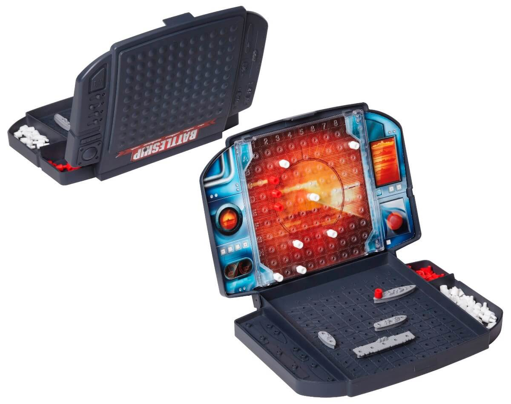
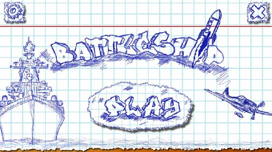

# Práctica Final: Batalla Naval

Crear un juego online para jugar a la batalla naval.

## Flujo de pantallas

1. Login: al ingresar a la pagina, se pedirá al usuario que se autentique
  - La autenticación sera por medio de Facebook.
2. Home: una vez autenticado, podrá jugar y ver el historial con algunas estadísticas de las partidas jugadas.
  - Para jugar, habrá un botón "Play" que buscara un contrincante, al encontrarlo, los llevara a la pantalla del juego (si todavía no hay nadie para desafiar, se quedara esperando que alguien mas se una al juego). 
  - El historial mostrara: el usuario contrincante, resultado (ganado, perdido, abandonado), fecha.
  - Bonus points: agregar duración y eficiencia.
  - Bonus points: gráfico de performance/eficiencia a través del tiempo, o porcentaje de ganados vs perdidos.
3. Juego, preparación:
  - Una vez encontrados los dos oponentes, se creara una nueva ejecución.
  - Cada jugador ubicara sus barcos en el tablero (drag&drop).
  - Una vez terminado, indicara que esta listo.
  - Si ambos jugadores están listos, los llevara a la batalla.
  - Bonus points: botón para disponer los barcos de manera automática.
  - Bonus points: tiempo de expiración, superado ese tiempo, los barcos que todavía no se ubicaron serán dispuestos automáticamente.
4. Juego, batalla:
  - Una vez que ambos ubicaron sus navíos, empezara un juego de turnos donde cada jugador hace su apuesta y disparara un tiro.
  - Los turnos serán dados por el servidor.
  - Al tener el turno, el jugador podrá disparar, de lo contrario esperara el tiro del oponente y luego será su oportunidad de contraatacar.
  - Se deberá mostrar feedback de cada tiro a ambos usuarios y el resultado de los mismos sera computado en el servidor.
  - Bonus points: botón "Auto-Play" para disparar automáticamente.
  - Bonus points: tiempo de expiración, superado ese tiempo, el tiro se dispara automáticamente.
5. Juego, fin:
  - Si el server detecta un ganador, se notificara a cada jugador su resultado.
  - Botón para volver a jugar contra el mismo oponente.
  - Botón para buscar otro oponente.
  - Botón para volver a la home.

## Entregas:

1. 01/06
  - Propuesta de diseño de pantallas en papel (papper prototiping). 
  - Login con Facebook
  - Home (únicamente con boton de play)
  - Prototipo de mensajería para el juego, donde se conecte a dos usuarios por websockets y estos puedan mensajearse entre si
2. 08/06 
3. 15/06

## Requerimientos:

- A la hora de la entrega, el juego deberá estar hosteado y disponible online.
- Podrán usarse todas las librerías y servicios SAS que se crean convenientes
  - Ejemplo: storage en SqlDB, MongoDB o DynamoDB...
- Bonus points: buen código, buen diseño y UX

