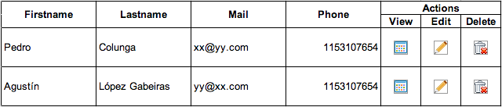

# Práctica: HTML

## Crear una página *concepts.html* que contenga:
1. Un indice apuntando al resto de las secciones y sus sub-secciones.

2. Una breve explicación de porqué es generalmente incorrecto usar el tag ` `, y ejemplificar su buen uso con la letra de una canción o poema.

3. Una lista de **definición** con una breve explicación de:
   1. URI
   2. URL
   3. HTML
   4. XHTML
   5. CSS

## Crear una segunda página *users.html* que contenga:

4. Una tabla como la detallada a continuación (ver sólo el formato no el estilo, es decir que no va ni alineada ni con borde, si con los íconos):

 

5. Un formulario con secciones para poder ingresar:
   1. Usuario (Nombre, Apellido, Mail, Telefono)
   2. Direccion (Calle, combo de Provincias, Código postal)
   3. Otra (Fecha de nacimiento con un máximo de 10 caracteres, Estado civil con un radio, Foto con un file chooser, Comentario con un textarea)
   4. Botones para enviar y cancelar la operación

## Requisitos:
- La página debe ser <!DOCTYPE html>:
  - No se permite el uso de tags para presentación.
  - Las páginas deben ser validadas usando el validator de W3C.
- Se debe formar el html usando el tag semánticamente más apropiado.
