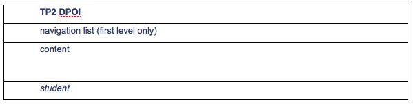
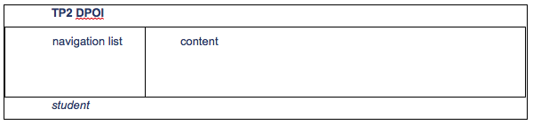

# Práctica 2: CSS

Darle estilo a las páginas del TP1 sobre (X)HTML:

1. Crear *theme.css* para darle un estilo general a la páginas (títulos, inputs, botones, links, listados, tablas, etc).
2. Crear *style.css* para alinear los labels e inputs del formulario (como si fuera una tabla).
3. Crear *print.css* con `media="print"` que esconda el título y la lista de navegación.
4. Crear dos layouts diferentes para la misma página html:
   1. *vertital.css* que este centrado y tenga un ancho fijo, con este formato: 
   2. *horizontal.css* que ocupe todo el ancho de la página, con este formato: 
El índice corresponde a las secciones de cada pagina. 

Para el caso de concepts.xhtml tendrá un link a la seccion de br y otro a la sección de definiciones (con sub-links a cada definicion).
Para users.html, un link a la tabla y otro al formulario.

## Requisitos:
- No se permite el uso de tags para presentación.
- El HTML usado debe ser el mismo para los diferentes layouts (solo cambios *minimos*)
- Las páginas deben ser validadas usando el W3C validator (html y css).
